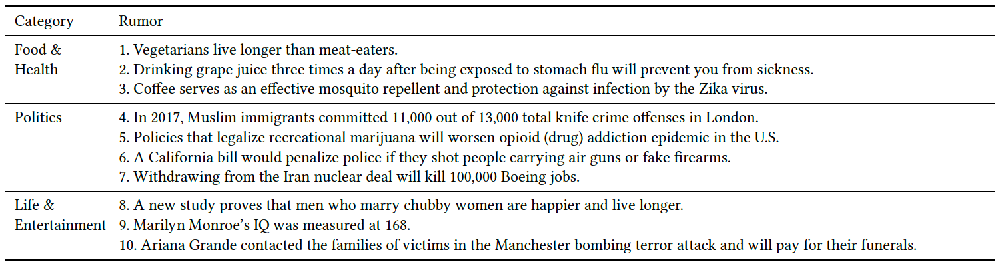

# The RumorStance Project

The data used in the paper "The presence of unexpected biases in online fact-checking" after being anonymized for the reproducibility of research outcomes.

The paper will be published in the Harvard Kennedy School Misinformation Review (https://misinforeview.hks.harvard.edu/) shortly.

##### Please cite as:
Park S, Park Y, Kang J, and Cha M <br>
The presence of unexpected biases in online fact-checking <br>
Harvard Kennedy School Misinformation Review, to be published in 2021. <br>

### Data Description

#### 1. Overview
```
- System used to conduct experiments simulating online news consumption environments: Amazon Mechanical Turk
- Dataset pre-processed and refined: rumorstance_response_clean.csv
- Total number of respondents (# of rows in the dataset): 11,145
```

#### 2. Feature codes
The below table is the tested rumors drawn from the unconfirmed list of claims on Snopes.com: 



Please find the detailed codes for each feature:
```
- 


```


Should you have any questions or comments, please contact us at the following email address: shaun01.park@gmail.com. <br> <br>

< end of document >
